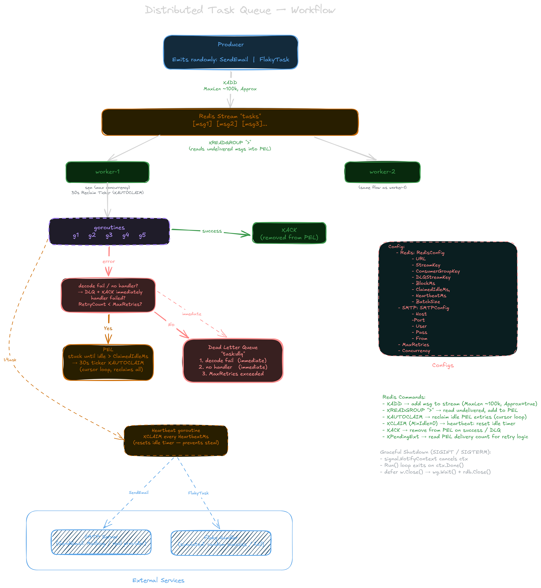

# Distributed task queue in Go

Distributed task queue in Go on Redis Streams: consumer groups, at-least-once delivery, retries with dead-letter queues, and Prometheus/Grafana observability.

## Overview

A background-job system in Go: a producer enqueues work and gets an immediate response, while a pool of workers processes it asynchronously in the background. The point is to **decouple a fast producer from slower consumers**; a web request shouldn't block while sending an email or calling a slow API.

## Getting started

**Prerequisites:** Docker + Docker Compose.

```bash
# build and start the stack (redis, mailhog, 3 workers, api, prometheus, grafana)
docker compose up -d --build
```

**Publish tasks:**

- Flags that can be used for docker producer tools profile:
  - **count:** Number of tasks (Default 1000).
  - **delay:** Delay in Ms added between task insertions ( Default 100).

```bash
# Populates a batch of tasks(1000 by default) via the producer CLI. Task type will be randomly chosen.
docker compose --profile tools run --rm producer --count 500 --delay 0

# or a single task via the HTTP API
curl -X POST http://localhost:8090/tasks \
  -H "Content-Type: application/json" \
  -d '{"type":"SendEmail","payload":{"to":"johndoe@email.com","subject":"hi","body":"hello"}}'
```

**Ports:**

| Service    | URL                   | Notes                                |
| ---------- | --------------------- | ------------------------------------ |
| API        | http://localhost:8090 | `POST /tasks`, `GET /healthz`        |
| MailHog    | http://localhost:8025 | inbox for sent emails                |
| Grafana    | http://localhost:3000 | dashboards (login `admin` / `admin`) |
| Prometheus | http://localhost:9090 | metrics + query UI                   |
| Redis      | localhost:6379        | the stream backend                   |

Sent emails land in MailHog's web UI; task metrics show up on the Grafana dashboards.

## Architecture



### How a task flows through the system

1. **Enqueue:** the producer (CLI or `POST /tasks`) `XADD`s the task to the `tasks` stream and returns immediately; the caller never waits for processing.
2. **Claim:** a worker reads it with `XREADGROUP`; Redis delivers it to **exactly one** worker and records it in the group's **Pending Entries List (PEL)** until acknowledged.
3. **Process:** the worker runs the handler in a goroutine (capped by `CONCURRENCY`):
   - **Success** → `XACK`.
   - **Failure** → retry up to `MAX_RETRIES`, then dead-letter to `task:dlq`.
   - **Undecodable or unhandled task** → skips retries, straight to the DLQ.
4. **Recover:** a heartbeat (`XCLAIM`) keeps long-running tasks from being stolen, and a ~30s `XAUTOCLAIM` sweep re-delivers anything stuck in the PEL; this covers both crashed workers and pending retries.
5. **Shutdown:** on `SIGTERM` the worker drains in-flight tasks before exiting; anything unfinished stays in the PEL and is reclaimed by another worker.

> **Note:** Reclaiming the DLQ (`task:dlq`) is a manual step; automatic reclaim only works the main stream's PEL, so dead-lettered tasks are never reprocessed on their own.

Throughout, each worker exposes metrics at `:2112/metrics`, scraped by Prometheus (`http://localhost:9090`) and shown in Grafana (`http://localhost:3000`, login `admin` / `admin`).

## Tech stack

| Tech               | Role            | Why                                                                                 |
| ------------------ | --------------- | ----------------------------------------------------------------------------------- |
| **Go**             | The application | Cheap goroutines for concurrency, static binaries (tiny images), strong stdlib      |
| **Redis Streams**  | Queue / log     | Consumer groups + PEL: delivery & recovery built in                                 |
| **Prometheus**     | Metrics store   | Purpose-built metrics TSDB; standard                                                |
| **Grafana**        | Dashboards      | Standard dashboards; native Prometheus fit                                          |
| **k6**             | Load testing    | JS scripts, native Prometheus remote-write, thresholds usable as CI gates           |
| **MailHog**        | Fake SMTP       | Local email capture, no real provider                                               |
| **Docker Compose** | Orchestration   | Brings the whole multi-service stack up wired and reproducible, in one command      |

## Project structure

```
.
├── cmd/           # entry points — api (HTTP), worker, producer (CLI)
├── internal/      # engine — config, consumer (queue logic), producer, dlq, metrics
├── monitoring/    # Prometheus scrape config + provisioned Grafana dashboards
├── load/          # k6 load-test script + its compose file
├── docker-compose.yml
└── Dockerfile     # multi-stage; one image builds any binary via a CMD build-arg
```

## Configuration

All configuration is via environment variables (12-factor). Defaults shown:

| Variable                  | Default                  | Description                                      |
| ------------------------- | ------------------------ | ------------------------------------------------ |
| `REDIS_URL`               | `redis://localhost:6379` | Redis connection string                          |
| `STREAM_KEY`              | `tasks`                  | Main task stream                                 |
| `CONSUMER_GROUP_KEY`      | `task-consumers`         | Consumer group name                              |
| `DLQ_STREAM_KEY`          | `task:dlq`               | Dead-letter stream                               |
| `BLOCK_MS`                | `5000`                   | `XREADGROUP` block timeout                       |
| `CLAIMED_IDLE_MS`         | `60000`                  | Idle time before a pending task can be reclaimed |
| `HEARTBEAT_MS`            | `10000`                  | How often an in-flight task refreshes its claim  |
| `BATCH_SIZE`              | `10`                     | Messages read per `XREADGROUP`                   |
| `MAX_RETRIES`             | `3`                      | Attempts before a task is dead-lettered          |
| `CONCURRENCY`             | `10`                     | Max concurrent handlers per worker               |
| `SMTP_HOST`               | `localhost`              | SMTP host                                        |
| `SMTP_PORT`               | `1025`                   | SMTP port                                        |
| `SMTP_USER` / `SMTP_PASS` | _(empty)_                | SMTP auth (blank = no auth, e.g. MailHog)        |
| `SMTP_FROM`               | `noreply@example.com`    | From address                                     |

## Observability

Open **Grafana** at http://localhost:3000 (`admin` / `admin`). The Prometheus datasource and dashboards are **provisioned from files** (`monitoring/grafana/`), so they load automatically and survive a volume wipe.

Each worker exposes Prometheus metrics on `:2112/metrics`; Prometheus scrapes all three:

| Metric                  | Type      | Meaning                                      |
| ----------------------- | --------- | -------------------------------------------- |
| `tasks_processed_total` | counter   | Tasks processed, by `task_type` and `status` |
| `tasks_in_flight`       | gauge     | Tasks currently being handled                |
| `task_duration_seconds` | histogram | Handler execution time (p95/p99)             |
| `tasks_dlq_total`       | counter   | Dead-lettered tasks, by `reason`             |

## Load & chaos testing

Run the k6 load test — it ramps 50 virtual users, sends a mix of `SendEmail`/`FlakyTask`/`UnknownTask`, and enforces p95/error-rate thresholds that double as a CI gate:

```bash
docker compose --profile tools run --rm k6
```

Sample run (50 VUs, ~2 min, on a laptop):

| Stage                | Result                                                       |
| -------------------- | ------------------------------------------------------------ |
| Enqueue (k6)         | ~13,000 req/s, 0% request errors                             |
| Processing (workers) | ~2,500 tasks/s; in-flight capped at `CONCURRENCY` (10/worker) |
| Latency              | enqueue p95 ~10 ms; handler p95 ~5–45 ms                     |

The ~13k-in / ~2.5k-out gap is the queue absorbing the burst. k6's 0% covers the **enqueue** path only — flaky/unknown tasks fail downstream by design and land in the DLQ. k6's metrics also stream to Grafana via remote-write.

**Chaos tested:** stop Redis mid-load → requests fail fast, then resume when it returns (streams survive via AOF); kill a worker → the others absorb the load and reclaim its tasks via `XAUTOCLAIM`.

## Design notes

**Why Redis Streams?** Consumer groups give competing consumers, per-message acks, and a pending list for crash recovery: task-queue semantics without building delivery guarantees yourself. Cheap to run (most stacks already have Redis) and fast (~13k enqueues/s on a laptop).

**Future improvements:**

- **Scheduled / delayed tasks:** "run this in 1 hour".
- **Priority queues:** separate streams or scoring for urgent work.
- **Idempotency keys:** delivery is at-least-once, so handlers should dedupe.
- **DLQ inspector UI:** view/requeue dead-lettered tasks (Grafana only shows aggregates).

**When to switch to Kafka?** Not "Redis vs Kafka" but "am I still a task queue, or an event log?". Reach for Kafka when you need:

- **Long retention + replay:** Redis trims; Kafka is disk-first.
- **Throughput past a single Redis node:** Kafka partitions scale out.
- **An event-streaming platform:** the same event fanned out to many teams.

For a task queue that just outgrows one node, **Asynq**, sharded Redis, or RabbitMQ fit better; Kafka is a poor task queue (no per-message ack, retry, or visibility timeout).
